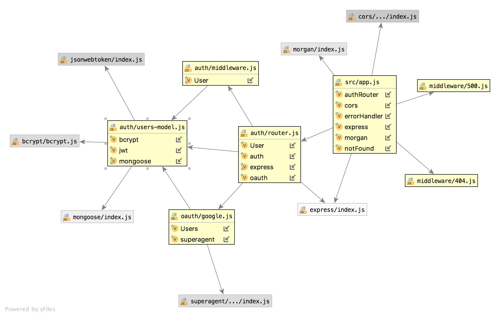

# LAB - 13

## Bearer Auth

### Author: Jessica Walters

### Links and Resources
* [submission PR](https://github.com/401-advanced-javascript-jessica/401-lab-13/pull/3)
* [travis](https://www.travis-ci.com/401-advanced-javascript-jessica/401-lab-13)
* [back-end](https://jessica-401-lab-13.herokuapp.com/)

#### Documentation
* [api docs](http://localhost:3333/api-docs)
* [jsdoc](https://jessica-401-lab-13.herokuapp.com/docs)

### Setup
#### `.env` requirements
* `PORT` - Port Number
* `MONGODB_URI` - URL to the running mongo instance/db
* `SECRET` - the secret string to encrypt tokens
* `SINGLE_USE` - boolean value
* `TOKEN_EXPIRE_TIME` - lifetime of token

#### Running the app
* `npm start`
* Endpoint: `/signin`
  * Returns a jwt
* Endpoint: `/signup`
  * Returns a jwt
* Endpoint: `/key`
  * Returns a jwt
  
#### Tests
* `npm run test`

#### UML
